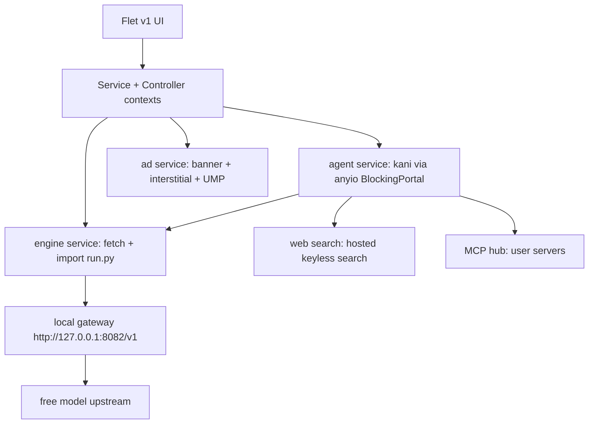

# LM Router

<p align="center">
  
</p>

<p align="center">
  <b>Chat with free models through your own local gateway. OpenAI compatible, no API key; the gateway runs on your device.</b>
</p>

---

## Download

| Platform | Package |
|---|---|
| Android | split APKs per ABI (`arm64-v8a`, `x86_64`) plus a universal AAB for Play |
| Windows | `LMRouter.exe` installer |
| Linux | `LMRouter.deb` / `LMRouter.rpm` / `LMRouter.tar.gz` |
| Source | `git clone https://github.com/Nwokike/lm-router` |

*Badges and direct links added after the first release build.*

### Android Architecture Build Splits

CI builds per-ABI APKs (`arm64-v8a`, `x86_64`) plus a universal AAB.

## Core Capabilities

| Capability | Powered by |
|---|---|
| Streaming chat with stop | `kani` + `flet` |
| Local OpenAI-compatible gateway | live `run.py` engine from router.kiri.ng, imported in-process |
| Web search tool | keyless hosted search over plain HTTP |
| MCP servers | `kani[mcp]` + official `mcp` SDK (stdio on desktop, remote HTTP everywhere) |
| Multi-provider | any OpenAI-compatible base URL, keys encrypted at rest |
| Ads + consent | `flet-ads` (banner + interstitial + UMP), same pattern as Sherlock/DDGS |

## Screenshots

*Screenshots added after the UI is built.*

## Features

- Chat screen (default): streaming replies, markdown with code highlighting, model picker, per-message token usage, conversation history
- Server screen: gateway status, start/stop, live logs, refresh model catalog
- Settings: theme (system/light/dark), gateway port and autostart, providers, MCP servers, search toggle, about/licenses
- Onboarding with terms gate and ad consent flow
- Offline banner, silent update check from `version.json`
- Desktop: closing the window minimizes to the taskbar, gateway keeps running

## Architecture



- One Flet process: the gateway runs as a daemon thread inside the app
- The gateway engine is fetched LIVE from `https://router.kiri.ng/run.py` on every startup, so upstream changes always reach the app. Nothing about the gateway is vendored or pinned in this repo — a bundled snapshot would silently shadow the live router. The only fallback is the last-known-good `engine_local.py` cache in app storage, which keeps a cold offline start working. The Server tab shows which source is active (`fetched`/`cached`)
- State: `@ft.observable AppState`, persisted settings as JSON with encrypted provider keys

## Local Development & Testing

### 1. Installation

```bash
uv sync
```

### 2. Run the Desktop App

```bash
uv run flet run
```

### 3. Run Linter & Tests

```bash
uv run ruff check src tests scripts
uv run ruff format --check src tests scripts
uv run pytest
```

### The gateway engine

There is nothing to refresh. The app downloads `https://router.kiri.ng/run.py`
on every startup and caches it to app storage, so the router is always the
current upstream release. To run the router on its own without the app:

```bash
curl -fsSL https://router.kiri.ng/run.py | python3
```

Its admin console is then at <http://127.0.0.1:8082/>.

## Privacy & Security

- The gateway runs on your own machine; conversation history is stored only on your device
- Prompts are forwarded to free third-party model providers, which may log them and use them for training — we have no control over that
- We store nothing ourselves: no accounts, no server-side chat records
- Provider API keys are encrypted at rest (Fernet) and never logged
- Logs redact bearer tokens, API keys and ANSI escapes before display
- No account required; mobile builds show Google AdMob ads

## Legal Disclaimer

Free models are provided by third parties under their own terms and rate limits.
Your messages are sent to those third parties: they may log your prompts and use
them for training. Model availability changes without notice. Ads are served by
Google AdMob on mobile builds only.

## Open Source Licenses

- [Flet](https://github.com/flet-dev/flet) (Apache-2.0), `flet-ads`, `flet-cli`, `flet-desktop`
- [kani](https://github.com/zhudotexe/kani) (MIT)
- [mcp](https://github.com/modelcontextprotocol/python-sdk) (MIT)
- pydantic, httpx, cryptography and the other runtime dependencies: see their PyPI pages
