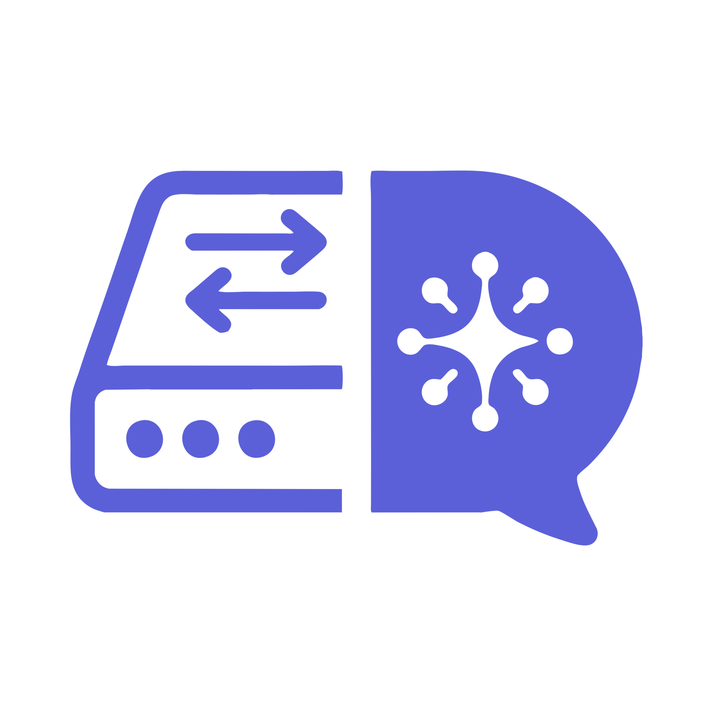
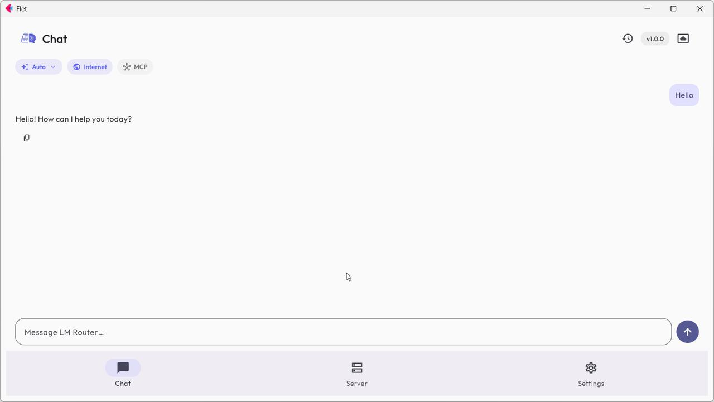
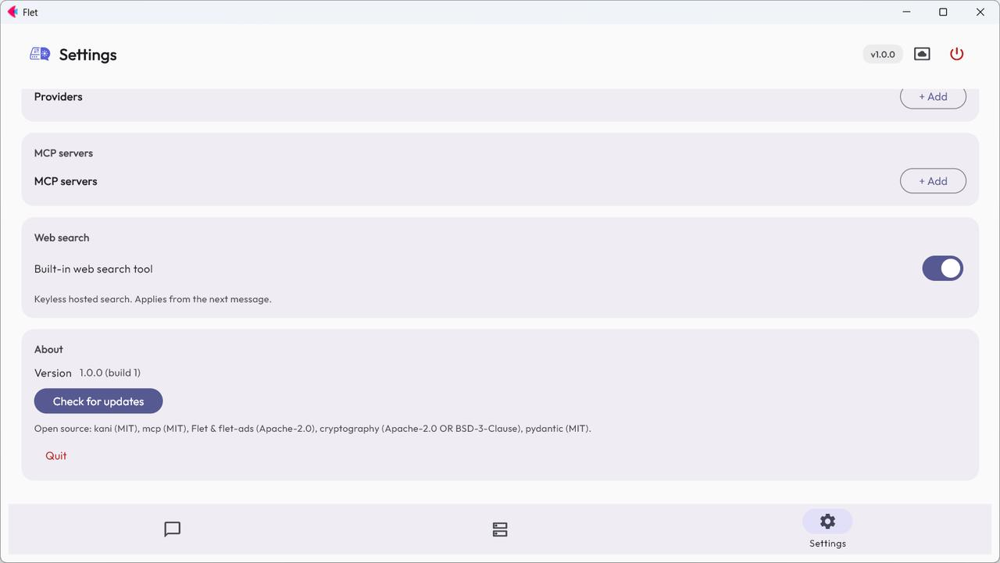
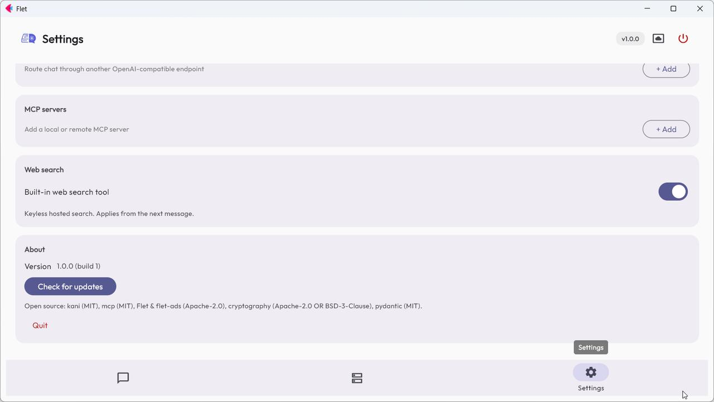
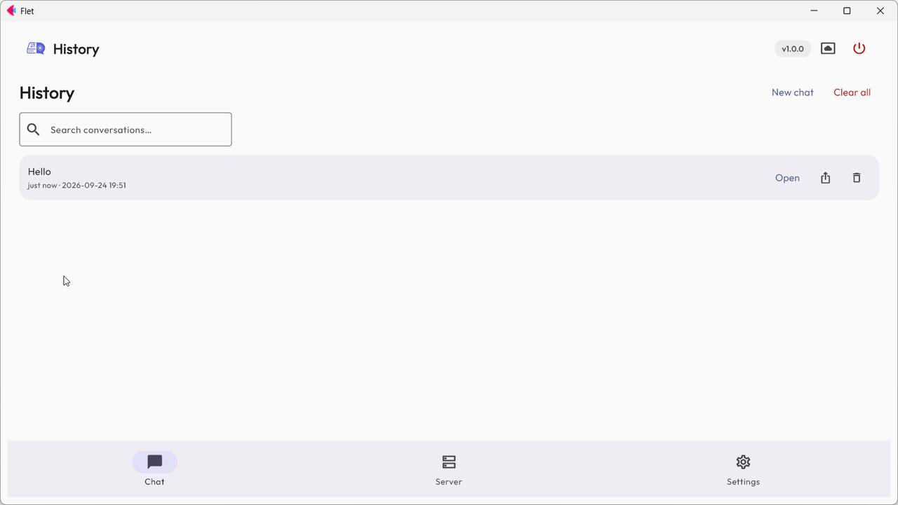
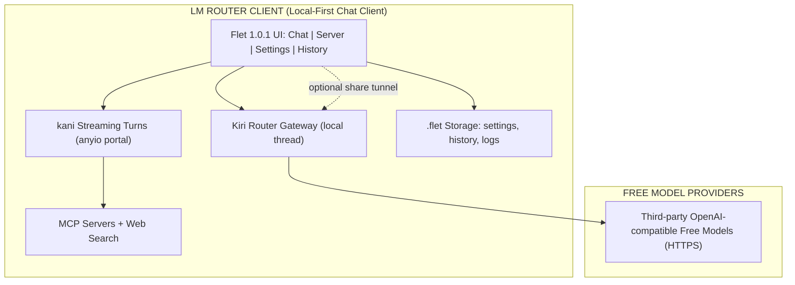

  

  Chat with free models through your own local gateway — OpenAI compatible, no account, no API key

  
  
  
  
  

---

## Download

| Platform | Download | Notes |
| :---: | :---: | :--- |
| 🤖 **Android** |  | Most phones — see the split table below for other architectures |
| 🪟 **Windows** |  | Automated standalone setup installer with desktop shortcut integration |
| 🐧 **Linux (Debian/Ubuntu)** |  | Desktop package tailored for Ubuntu, Debian, Linux Mint & Pop!_OS |
| 🎩 **Linux (Fedora/RHEL)** |  | Desktop package tailored for Fedora, openSUSE, RHEL & CentOS |
| 📦 **Linux (Universal Portable)** |  | Universal standalone portable archive for Arch, Alpine, Steam Deck & all distros |

### Android Architecture Build Splits

| Variant | Download | Notes |
| :--- | :---: | :--- |
| 📱 **ARM64** (most phones) | [**lm-router-arm64-v8a.apk**](https://github.com/Nwokike/lm-router/releases/latest/download/lm-router-arm64-v8a.apk) | Modern 64-bit Android devices |
| 📱 **ARMv7** (older phones) | [**lm-router-armeabi-v7a.apk**](https://github.com/Nwokike/lm-router/releases/latest/download/lm-router-armeabi-v7a.apk) | Legacy 32-bit Android devices |
| 💻 **x86_64** (emulators) | [**lm-router-x86_64.apk**](https://github.com/Nwokike/lm-router/releases/latest/download/lm-router-x86_64.apk) | Chromebooks & Android emulators |

---

## Core Capabilities

| Capability | Description |
| :--- | :--- |
| **Local Gateway** | An OpenAI-compatible gateway runs on your own machine at `127.0.0.1` — no account, no API key, no server in between. Your OpenAI-compatible clients point straight at it. |
| **The `auto` Model** | One model that rotates across healthy free models for you, preferring ones that can call tools — so a dead or rate-limited model never ends your chat. |
| **Streaming Chat** | Token-by-token replies with visible reasoning (collapsible while it thinks), expandable tool calls, per-message token usage, stop-and-keep-partial. |
| **Web Search** | Built-in search tool with automatic fallback to keyless sources, so a capped provider never kills an answer. |
| **MCP Servers** | Add your own MCP servers; enable, disable and test their tools from Settings. |
| **Multi-Provider** | Route chat through any OpenAI-compatible endpoint with an optional key stored only on your device. |
| **Share** | Publish your gateway through a public tunnel with an optional API key, and hand a friend the full model catalog. |
| **History & Export** | Conversations stay on your device; open, search, copy and export them as Markdown. |

---

## Screenshots

<table>
  <tr>
    <td width="50%"></td>
    <td width="50%"></td>
  </tr>
  <tr>
    <td align="center"><em>Chat with the auto model, web search and MCP in one session bar.</em></td>
    <td align="center"><em>Your gateway running on-device, with per-model rate limits and endpoint types.</em></td>
  </tr>
  <tr>
    <td width="50%"></td>
    <td width="50%"></td>
  </tr>
  <tr>
    <td align="center"><em>Generation controls, gateway behaviour and close-to-background.</em></td>
    <td align="center"><em>Conversations stay on your device; export to markdown.</em></td>
  </tr>
</table>

---

## Features

- **Streaming Chat** — token-by-token replies with markdown tables and code highlighting, visible reasoning blocks, expandable tool calls, and per-message token usage.
- **Regenerate & Edit** — long-press or right-click any message to copy it, re-run the last reply, or edit-and-resend the last question.
- **Server Console** — gateway status, start/stop, live logs with level filters, refresh model catalog, and the full catalog with per-model rate limits and endpoint types.
- **Settings** — theme, generation parameters, gateway port and autostart, providers, MCP servers, search toggle, About.
- **Onboarding** — terms gate and consent flow before first use.
- **Updates** — silent version check with release notes, plus a manual check from Settings.
- **Desktop** — closing the window keeps the gateway running in the background; Quit is always one click away.

---

## Architecture

| Layer | Technology | Purpose |
| :--- | :--- | :--- |
| **Frontend** | Flet 1.0.1 on Python 3.14 | Cross-platform UI — components, contexts, observable state, Markdown, services |
| **Chat Core** | kani (OpenAI engine) on an anyio portal | Streaming turns, tool calling, reasoning capture, token budgeting |
| **Gateway** | router.kiri.ng fetched at startup | Local OpenAI-compatible endpoint with model discovery, health and rate hints |
| **Tools** | Official mcp SDK + keyless HTTP search | Remote/local MCP servers and built-in web search with fallback |
| **Sharing** | Stdlib auth proxy + public tunnel | Optional key-protected exposure of the local gateway to a friend's client |

### Visual Flow

---

## Privacy & Security

1. **On your device**: the gateway runs locally, binds only to `127.0.0.1`, and conversation history and settings stay on this machine.
2. **No account**: no registration, no login, and no user API key is required for the built-in gateway.
3. **Prompts go to third parties**: model requests are sent to free providers that may log them and use them for training — we have no control over that.
4. **Keys stay local**: any provider key you add is stored on this device only and never logged.
5. **Ad-supported on mobile**: mobile builds show Google AdMob ads, with consent managed through Google UMP.

## Legal Disclaimer

Free models are provided by third parties under their own terms and rate limits.
Your messages are sent to those third parties: they may log your prompts and use
them for training. Model availability changes without notice. Ads are served by
Google AdMob on mobile builds only.

## Open Source Licenses

- [Flet](https://github.com/flet-dev/flet) and `flet-ads` (Apache-2.0)
- [kani](https://github.com/zhudotexe/kani) (MIT)
- [mcp](https://github.com/modelcontextprotocol/python-sdk) (MIT)
- [Kiri Router](https://router.kiri.ng) — the local gateway this app runs
