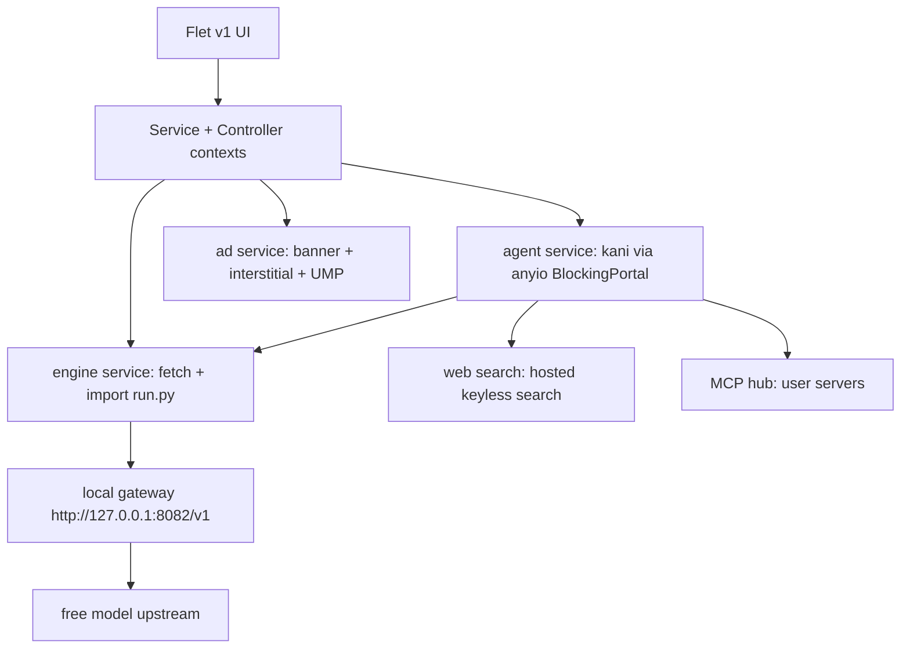

# LM Router

<p align="center">
  
</p>

<p align="center">
  <b>Chat with free models through your own local gateway. OpenAI compatible, no API key, runs on your device.</b>
</p>

---

## Download

| Platform | Package |
|---|---|
| Android | `LMRouter-arm64-v8a.apk` / `LMRouter-x86_64.apk` (split builds), AAB for Play |
| Windows | `LMRouter_Setup.exe` |
| Linux | `.deb` / `.rpm` / `.tar.gz` |
| Source | `git clone https://github.com/Nwokike/lm-router` |

*Badges and direct links added after the first release build.*

### Android Architecture Build Splits

CI builds per-ABI APKs (`arm64-v8a`, `x86_64`) plus a universal AAB.

## Core Capabilities

| Capability | Powered by |
|---|---|
| Streaming chat with stop | `kani` + `flet` |
| Local OpenAI-compatible gateway | pinned `run.py` engine from router.kiri.ng, imported in-process |
| Web search tool | keyless hosted search over plain HTTP |
| MCP servers | `kani[mcp]` + official `mcp` SDK (stdio on desktop, remote HTTP everywhere) |
| Multi-provider | any OpenAI-compatible base URL, keys encrypted at rest |
| Ads + consent | `flet-ads` (banner + interstitial + UMP), same pattern as Sherlock/DDGS |

## Screenshots

*Screenshots added after the UI is built.*

## Features

- Chat screen (default): streaming replies, markdown with code highlighting, model picker, per-message token usage, conversation history
- Server screen: gateway status, start/stop, live logs, refresh model catalog
- Settings: theme (system/light/dark), gateway port and autostart, providers, MCP servers, search toggle, about/licenses
- Onboarding with terms gate and ad consent flow
- Offline banner, silent update check from `version.json`
- Desktop: closing the window minimizes to the taskbar, gateway keeps running

## Architecture



- One Flet process: the gateway runs as a daemon thread inside the app
- The gateway engine is fetched from `https://router.kiri.ng/run.py` at startup, version-pinned in `version.json` (`engine_version`, `engine_sha256`), with a bundled fallback at `src/assets/engine/run.py`
- State: `@ft.observable AppState`, persisted settings as JSON with encrypted provider keys

## Local Development & Testing

### 1. Installation

```bash
uv sync
```

### 2. Run the Desktop App

```bash
uv run flet run
```

### 3. Run Linter & Tests

```bash
uv run ruff check src tests scripts
uv run ruff format --check src tests scripts
uv run pytest
```

### Refresh the bundled gateway engine

```bash
uv run python scripts/fetch_engine.py
```

Downloads `https://router.kiri.ng/run.py`, writes `src/assets/engine/run.py`,
and records `engine_version` + `engine_sha256` in `version.json`.

## Privacy & Security

- Chat runs through a gateway on your own machine; nothing is stored by us
- Provider API keys are encrypted at rest (Fernet) and never logged
- Logs redact bearer tokens, API keys and ANSI escapes before display
- No account, no telemetry

## Legal Disclaimer

Free models are provided by third parties under their own terms and rate limits.
Model availability changes without notice. Ads are served by Google AdMob on
mobile builds only.

## Open Source Licenses

- [Flet](https://github.com/flet-dev/flet) (Apache-2.0), `flet-ads`, `flet-cli`, `flet-desktop`
- [kani](https://github.com/zhudotexe/kani) (MIT)
- [mcp](https://github.com/modelcontextprotocol/python-sdk) (MIT)
- pydantic, httpx, cryptography and the other runtime dependencies: see their PyPI pages
